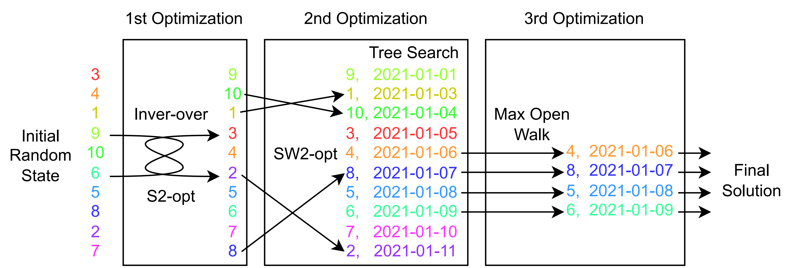

# active-debris-removal
So, space debris can be modeled as a complex TSP problem.

Problem: https://www.esa.int/Safety_Security/Space_Debris/Active_debris_removal

Solution:
- Inver-over genetic algorithm
- Interpolated tree search
- Ranged and Stochastic 2-opt (kopt)
- Maximal open walk

Publications:
- Static: <a href="https://doi.org/10.1007/978-3-030-91702-9_10" target="_blank">doi.org/10.1007/978-3-030-91702-9_10</a>
- Time-Dependent: <a href="https://doi.org/10.1109/CEC55065.2022.9870437" target="_blank">doi.org/10.1109/CEC55065.2022.9870437</a>

